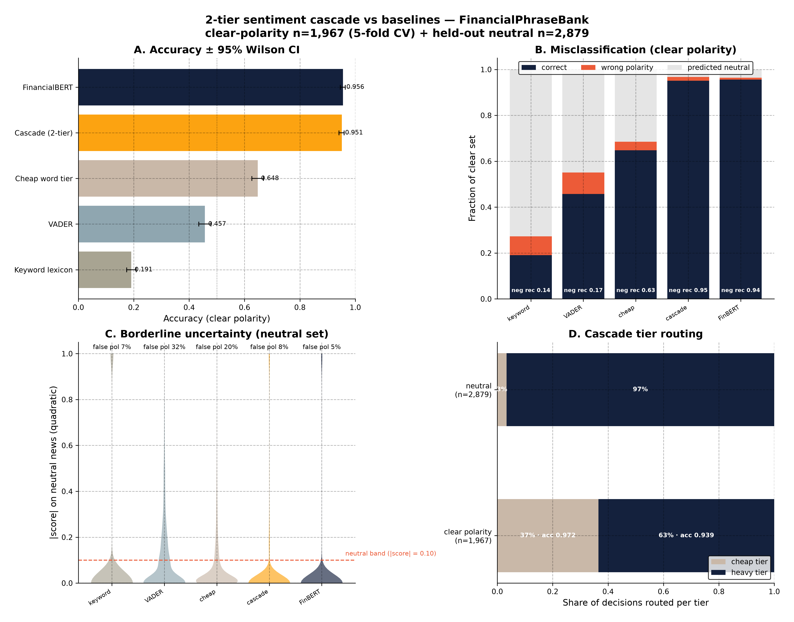
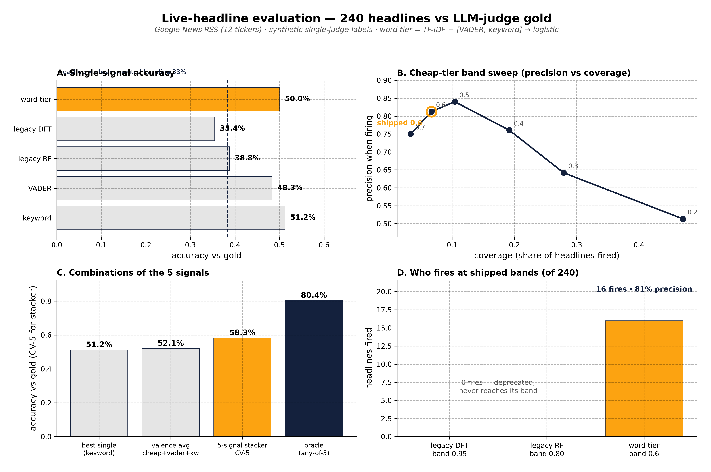

# letter-valence-research

**Can the letters of an English word predict its sentiment?** 68 letter-derived
features → RF **0.7377 ± 0.0058 CV** (held-out 20%: 0.751) on financial sentences —
a real but weak signal. A word-level tier classifies sentiment better, so the letter
tiers were replaced in the production cascade.

Test @ [https://letter-valence-research-git-main-name-a0b0.vercel.app/](https://letter-valence-research-git-main-name-a0b0.vercel.app/)
— works best on article snippets, not single-sentence strings.


## Key numbers

| Question | Answer |
|---|---|
| How good? | 0.7377 5-fold CV, 0.751 held-out (majority baseline 0.693) |
| Noise? | permutation test: 0/50 label shuffles beat it (p < 0.02) |
| Better than existing tools? | No — tuned VADER 0.750, FinBERT ~0.87 |
| Strongest family | spectral DFT alone 0.7346; strongest feature `vowel_ratio` (r = +0.049) |
| Do the numerology features work? | No — none survive Bonferroni; dropping the modular family leaves 0.7422 |
| Effect size (single word) | ~0.24% variance — the signal appears only when averaging over words |
| Speed / bottleneck | ~50k cls/s/CPU; learning curve plateaus at n ≈ 1,376 (feature-bound) |

## The sentiment cascade (production outcome)

The letter model lost the cheap-tier job: the DFT probe never fires on FPB
(max |v| 0.922 < 0.95) and the letter RF fires on 3.6% of sentences. The shipped
design is a **2-tier cascade** — word cheap tier (TF-IDF 1–2 grams + VADER +
keyword → 3-class logistic, decides at |v| ≥ 0.6) → FinancialBERT, VADER as final
fallback. Engine lives in `src/sentiment_engine/` (legacy letter engine kept for
comparison).

- **FinancialPhraseBank:** cheap tier decides 36.6% of clear-polarity calls at
  97.2% accuracy; cascade 0.9512 vs 0.9558 heavy-only (McNemar p = 0.15, ns) while
  cutting transformer load by a third; neutral false-polarity 19.6% → 7.7%.
- **NewsMTSC (general news):** with a domain-appropriate heavy, the news-cheap
  cascade reaches 0.6190 vs heavy-only 0.5760 (McNemar p ≈ 8×10⁻⁷); the
  finance-tuned FinancialBERT collapses out-of-domain (0.30 — below the 0.616
  majority baseline). The cascade approach generalises; the finance-tuned heavy is
  the domain-locked part.
- *Leak caveat:* FinancialBERT was itself fine-tuned on FPB, so absolute in-domain
  numbers are optimistic; relative comparisons share the same heavy and are unaffected.



Full numbers: `results/cascade_benchmark.json`, `results/general_news_benchmark.json`.

## Live-headline validation (2026-09-25)

240 live Google News RSS headlines vs single-LLM-judge synthetic gold
(92 neutral / 89 positive / 59 negative). Harness `src/cascade_eval.py`,
engine `src/sentiment_engine/`:

- legacy letter tiers: **0 fires** at shipped bands (0.95 / 0.80)
- word tier: 16 fires (6.7% coverage) at **81.2% precision** (band sweep peaks at
  84% for band 0.5)
- VADER 48.3% overall (keyword 51.2%), but 79% precision at |compound| ≥ 0.6
- 5-signal CV stacker **58.3%** vs best single 51.2%; oracle ceiling 80.4%



## Features

68 features in 12 families computed from a word's letters plus corpus letter
statistics: alphabet-position sums, modular/gematria arithmetic, letter frequency,
bigrams, CMUdict phonetics, vowel/consonant shape, word length, centeredness,
**spectral (DFT + autocorrelation)**, gzip compression, symmetry/run-length.
The DFT and vowel/consonant families carry the signal; the numerology families
contribute ~ nothing. Exact formulas: docstrings in `src/features.py`.

## Repository structure

```
letter-valence-research/
├── src/            ← features, training, evaluation, figures, cascade eval, sentiment_engine/
├── data/           ← FPB sentences, Warriner norms, CMUdict, NewsMTSC, cascade_test/
├── results/        ← CV tables, cascade + general-news benchmarks (JSON/CSV)
├── figures/        ← 19 PNGs (300 dpi) + animations/
├── models/         ← cheap_tier.pkl, letter_sentiment_rf.pkl
├── tests/          ← 33 unit tests
├── notebooks/      ← 01_reproduce_main_result.ipynb
├── METHODOLOGY.md · research_report.md · blog_post.md · lit_digest.md
├── TEMPLATE.md · docs/ · requirements.txt · CITATION.cff · LICENSE
```

## Reproducing

```bash
cd data && ./download.sh && cd ..   # data is committed; script re-fetches if needed
pip install -r requirements.txt

python -m src.analyze                # full pipeline → results/ + figures/ (~10 min)
python -m src.visualise              # DFT + SHAP panels
python -m src.train_final            # save models/letter_sentiment_rf.pkl
python -m src.classify --text "The company reported record earnings." --compare
python -m unittest discover tests/

# cascade evaluations (need torch + transformers; HF download on first run)
python -m src.benchmark_cascade && python -m src.figures_cascade
python -m src.benchmark_general && python -m src.figures_general

# live-headline harness (heavy tier offline)
python -m src.cascade_eval && python -m src.figures_headline
```

## Honest limits

- Financial text only, English only; single words are unreliable — the effect
  appears when averaging across words.
- Does not beat tuned VADER (0.750) or FinBERT (~0.87); per-word R² ≈ 0.005.
- FPB cascade absolutes are optimistic (leak caveat above); the live-headline gold
  is single-judge synthetic.
- The letter finding is real psycholinguistics — just not the right production
  cheap tier.

## More detail

`METHODOLOGY.md` (full reproduction) · `research_report.md` (formal report) ·
`lit_digest.md` (per-paper digest) · `TEMPLATE.md` (research-artifact structure) ·
`results/` (machine-readable) · `blog_post.md` (narrative draft).

## License

- **Code** (`src/`, `tests/`, `data/download.sh`): MIT
- **Prose and figures** (`README.md`, `blog_post.md`, `research_report.md`,
  `lit_digest.md`, `figures/`, `docs/`): CC-BY-4.0
- **Data**: see `data/README.md`

## Citation

See `CITATION.cff`.

## Acknowledgments

Warriner, Kuperman & Brysbaert (2013); Malo et al. (2014) FinancialPhraseBank;
Hamborg et al. (2021) NewsMTSC; Adelman, Estes & Cossu (2018) and Aryani et al.
(2018) sound symbolism; CMU Pronouncing Dictionary; the OSS toolchain.
