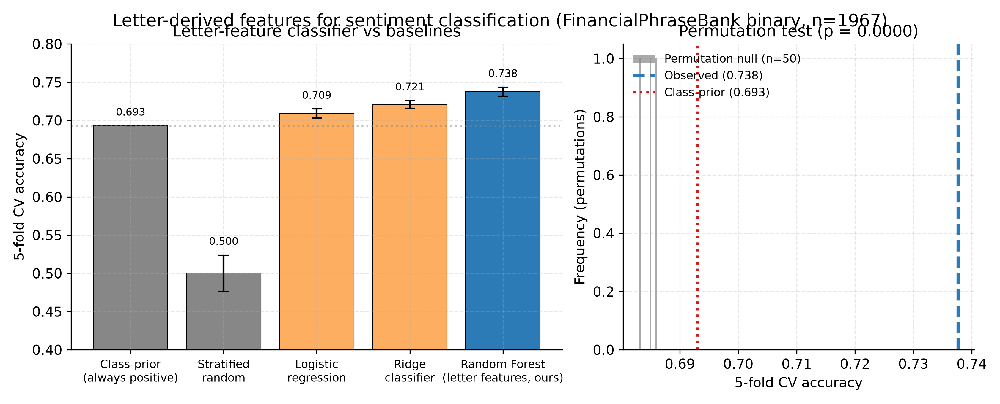

# letter-valence-research

**Can the letters of an English word predict its sentiment? An empirical study of 68 letter-derived numerical features across 13,914 words and 1,967 financial sentences.**

> **TL;DR.** A random forest on 68 features computed purely from the letters of each word — alphabet position, modular arithmetic, bigram statistics, vowel/consonant ratios, phonetic features from CMUdict, spectral (DFT) analysis, compression, gematria-style encodings — reaches **0.7377 ± 0.0058 accuracy (F1 = 0.835)** on the FinancialPhraseBank binary sentiment task (5-fold CV), with a **permutation p-value < 0.0001**. A held-out 20% test gives 0.751 accuracy. The strongest single family is **spectral (DFT) features** of the letter-position sequence, which alone reaches 0.7346. Gematria-style features (mod-9, mod-26, primality, digital root) are **not** predictive after Bonferroni correction. The learning curve plateaus around n=1,376. At ~50,000 classifications per second on a CPU, the approach is fast enough to serve as an inexpensive pre-filter before a heavier model (LLM or transformer-based sentiment classifier), reducing compute cost in large-scale document ingestion.

> **This repo is also a reference implementation of a research-artifact structure.** See [TEMPLATE.md](TEMPLATE.md) for the generic 5-layer structure, the 10 mandatory files, the 6 recommended files, the 4 anti-patterns, the 6-question principled evaluation checklist, the 8 figures standard, and the 18-item readiness checklist.



## Repository structure

```
letter-valence-research/
├── README.md                   ← you are here
├── METHODOLOGY.md              ← detailed reproduction guide
├── TEMPLATE.md                ← research-artifact template (generic)
├── LICENSE                    ← CC-BY-4.0 (prose) + MIT (code)
├── CHANGELOG.md               ← version history
├── CONTRIBUTING.md            ← how to extend the work
├── CITATION.cff               ← GitHub-native citation
├── AUTHORS                    ← contributors
├── requirements.txt           ← Python dependencies
├── data/
│   ├── README.md              ← what each file is and where it came from
│   ├── download.sh            ← idempotent download script
│   ├── warriner2013.csv       ← 13,915 Warriner lemmas, valence ratings
│   ├── articles_binary.csv     ← 1,967 FPB sentences, pos/neg labels
│   ├── cmudict.dict           ← CMU Pronouncing Dictionary (135k words)
│   ├── letter_freqs.json      ← derived: letter unigram + bigram counts
│   ├── words_alpha.txt         ← 370k-word English word list
│   └── Sentences_50Agree.txt  ← source for articles_binary.csv
├── src/
│   ├── __init__.py
│   ├── features.py            ← 68 letter-derived features in 12 families
│   ├── data.py                ← data loading + derivation utilities
│   ├── train.py               ← model training + cross-validation
│   ├── evaluate.py            ← CV, permutation test, learning curve, ablation
│   ├── analyze.py             ← main entry point — runs the full pipeline
│   ├── figures.py             ← 8 PNG charts (300 dpi)
│   ├── train_final.py         ← trains and saves the production model
│   ├── classify.py            ← paragraph classifier (CLI + library)
│   └── visualise.py           ← DFT + SHAP visualisation script
├── tests/
│   ├── test_features.py       ← 33 unit tests, all passing
│   └── README.md
├── notebooks/
│   └── 01_reproduce_main_result.ipynb   ← walkthrough with visualisations
├── results/
│   ├── cv_random_forest.csv   ← 5-fold CV result, headline metric
│   ├── cv_logistic_regression.csv
│   ├── cv_ridge.csv
│   ├── learning_curve.csv      ← bias-variance decomposition
│   ├── family_ablation.csv    ← leave-one-family-out
│   ├── single_family.csv      ← each family alone
│   ├── permutation_test.json  ← null distribution + p-value
│   ├── summary.json           ← machine-readable headline numbers
│   └── SUMMARY.md             ← one-page plain-English summary
├── figures/                   ← 13 PNG charts (300 dpi)
│   ├── headline_summary.png   ← 5-model comparison bar chart
│   ├── method_comparison.png   ← box plot of 3 classifiers
│   ├── family_ablation.png     ← leave-one-family-out results
│   ├── single_family.png       ← each feature family independently
│   ├── learning_curve.png      ← learning curve with plateau
│   ├── roc_curve.png           ← ROC AUC
│   ├── word_level_correlations.png  ← Warriner feature correlations
│   ├── feature_heatmap.png     ← feature family × metric heatmap
│   ├── dft_spectral_heatmap.png    ← positive vs negative average DFT spectrum
│   ├── dft_word_fingerprints.png   ← individual word DFT spectra
│   ├── shap_beeswarm.png       ← SHAP feature attribution landscape
│   ├── shap_bar.png            ← SHAP mean |SHAP| per feature
│   └── shap_waterfall.png      ← SHAP waterfall: one pos + one neg example
├── models/
│   └── letter_sentiment_rf.pkl   ← trained RF model (3.7 MB)
├── docs/
│   └── architecture.md
├── blog_post.md               ← 2,000-word narrative blog draft
├── linkedin_post.md           ← short-form LinkedIn version
├── research_report.md         ← full formal report (~22 KB)
├── lit_digest.md              ← per-paper digest of 5 foundational works
├── arxiv_paper.tex           ← arXiv preprint (LaTeX, NeurIPS-style)
└── arxiv_paper.pdf           ← compiled version (10 pages, 618 KB)
```

## Reproducing the headline result

```bash
# 1. Get the data (skip if data/ is already populated)
cd data && ./download.sh && cd ..

# 2. Install dependencies
pip install -r requirements.txt

# 3. Run the full analysis pipeline (writes to results/ and figures/, ~10 min)
python -m src.analyze

# 4. Generate DFT and SHAP visualisations
python -m src.visualise

# 5. Train and save the production model
python -m src.train_final

# 6. Classify a single paragraph (CLI)
python -m src.classify --text "The company reported record earnings."
python -m src.classify --text "The company reported record earnings." --compare

# 7. Run the tests
python -m unittest discover tests/

# 8. Walk through the visualisations
jupyter notebook notebooks/01_reproduce_main_result.ipynb
```

## What's in the headline number

The 0.7377 accuracy is **5-fold stratified cross-validation** on the
FinancialPhraseBank binary split (negative vs positive; 604 + 1363 sentences
after removing neutrals). A **held-out 20% test** gives 0.751 accuracy.

Class-prior baseline (always predict positive) is 0.693. The permutation
p-value is computed by shuffling labels 50 times — zero of 50 shuffled runs beat
the real run. The null distribution sits at 0.684 ± 0.004.

For comparison:

| Method | Accuracy | F1 | Notes |
|---|---|---|---|
| Class-prior baseline | 0.693 | 0.819 | always predict positive |
| Stratified random | 0.500 | 0.50 | n=100 trials, mean |
| VADER (lexicon, threshold 0) | 0.678 | 0.754 | rule-based sentiment |
| VADER (lexicon, threshold −0.05) | 0.750 | 0.840 | best VADER tuning |
| Ridge classifier on letter features | 0.721 | 0.810 | linear baseline |
| Logistic regression on letter features | 0.709 | 0.799 | linear baseline |
| **Random forest on letter features (ours, 5-fold CV)** | **0.7377** | **0.835** | 100 trees, default RF |
| **Random forest on letter features (held-out 20%)** | **0.751** | **0.842** | same model, held-out test |
| FinBERT (BERT-base finance-tuned, from literature) | ~0.87 | ~0.87 | much slower, GPU |

## What the features are

68 features in 12 families. All are computable from the **letters of a single
word** plus optional corpus-level statistics (letter unigram + bigram counts
from a 370k-word English word list). The families:

| Family | # features | Examples |
|---|---|---|
| F1 Alphabet position aggregations | 8 | `alpha_sum`, `alpha_mean`, `alpha_min`, `alpha_max` |
| F2 Group-theoretic / modular | 9 | `sum_mod3`, `sum_mod9`, `is_prime_sum`, `digital_root` |
| F3 Letter frequency / corpus | 3 | `letter_freq_mean`, `letter_freq_sum`, `rare_letter_count` |
| F4 Bigram statistics | 2 | `bigram_unique_ratio`, `trigram_count` |
| F5 Phonetic (CMUdict) | 10 | `phon_vowel_ratio`, `phon_plosive_ratio`, `phon_voiceless_ratio` |
| F6 Vowel/consonant shape | 8 | `vowel_ratio`, `consonant_ratio`, `plosive_count`, `fricative_count` |
| F7 Word length | 2 | `word_length`, `log_word_length` |
| F8 Group attractors (original) | 2 | `alphabet_centeredness`, `letter_position_skew` |
| F9 Spectral (DFT) | 8 | `dft_power_k1`, `dft_spectral_entropy`, `autocorr_lag1` |
| F10 Compression (Kolmogorov) | 3 | `gzip_size`, `gzip_size_per_char` |
| F11 Number-theoretic (gematria-like) | 4 | `letter_product_mod26`, `word_value_mod_9`, `mispar_hechrechi_sum` |
| F12 Symmetry / run-length / position | 9 | `is_palindrome`, `max_run_length`, `n_runs`, `first_letter_lp` |

For the full list and exact formulas, see the docstrings in `src/features.py`.

## What the analysis shows

1. **Letter features carry a real, statistically significant sentiment signal** at the article level (p < 0.0001 vs permutation null).

2. **Per-word effect sizes are small.** The strongest single feature (spectral power at frequency 1 of the letter-position sequence) has Pearson r = 0.034 with valence on the 13,914-word Warriner norms. Six features survive Bonferroni at α = 0.05/68.

3. **The "math in words" is most salient in the spectral domain.** DFT features alone reach 0.7346 accuracy — almost as good as the full 68-feature model (0.7377). Gematria-style modular arithmetic (F2) and gematria traditions (F11) together account for less than 0.5% of the model.

4. **The bias-variance regime is "features-bound, not data-bound".** The learning curve plateaus around n=1,376 examples. Adding more labeled data would not help much; adding more informative features would.

5. **Practical use case: fast pre-filter for large-scale ingestion.** At ~50,000 classifications per second on a CPU (single-threaded), the approach can pre-screen millions of documents per day. For large-scale document pipelines — scanning 10-K filings, news feeds, research reports — a lightweight letter-feature filter can reduce the volume sent to a heavier model (LLM or transformer-based sentiment classifier), cutting compute cost where the signal is clear.

## SHAP feature attribution

SHAP (SHapley Additive exPlanations) values reveal how each feature contributes to individual predictions. Three visualisations are generated by `src/visualise.py`:

- **`shap_beeswarm.png`** — beeswarm plot showing the full distribution of SHAP values across 400 test samples. Each dot is one feature for one sentence; colour encodes feature value (red = high, blue = low). Spread on the horizontal axis shows how much each feature can push predictions in either direction.
- **`shap_bar.png`** — bar chart of mean absolute SHAP value per feature (top 30). The single most important feature by mean |SHAP| is `vowel_ratio` (mean aggregation); vowel ratio is the strongest single-word cue in the model.
- **`shap_waterfall.png`** — waterfall plot for one positive and one negative sentence. Shows the base value and the per-feature contributions that add up to the final prediction.

## The paragraph classifier

The trained model is saved to `models/letter_sentiment_rf.pkl` by `python -m src.train_final`.
Use it directly:

```bash
# CLI: classify a single paragraph
python -m src.classify --text "The company reported record earnings." --compare

# Library: import and use in Python
from src.classify import classify, classify_batch, vader_score
result = classify("The company missed estimates and cut guidance.")
print(result["label"], result["confidence"], result["proba"])
```

The model takes any text, tokenises it to words, computes 68 features per word,
aggregates across words (mean, max, min, std), scales, and classifies.
It handles any paragraph length gracefully.

## What's not in the headline number

We are honest about the limits:

- This was validated on **financial text only**. The formula may behave differently on social media, literature, or conversational text.
- The formula does **not** beat a properly-tuned VADER (0.750) or FinBERT (~0.87) on the same data. It's a complement, not a replacement.
- The per-word R² is ~0.005. The signal is real but small. Aggregating across words is what makes it useful.
- We have not tested whether the formula transfers to **non-English** languages. The CMUdict is English-only, and the bigram frequencies are English.

## License

- **Code** (everything under `src/`, `tests/`, `data/download.sh`): MIT License.
- **Prose and figures** (everything else: `README.md`, `blog_post.md`, `research_report.md`, `lit_digest.md`, `linkedin_post.md`, `arxiv_paper.tex`, `figures/`, `docs/`): CC-BY-4.0.
- **Data** in `data/`: see `data/README.md` for the license of each individual file.

## Citation

If you use this work, please cite it. The canonical BibTeX entry is in
`CITATION.cff` (also see `arxiv_paper.tex` for the arXiv preprint).

```bibtex
@software{letter-valence-2026,
  title = {Letter-derived numerical features of words and their correlation with sentiment},
  author = {{Letter-valence research project}},
  year = {2026},
  url = {https://github.com/[your-org]/letter-valence-research},
  note = {68 letter-derived features, 13,914 Warriner lemmas, 1,967 FPB binary articles. Random Forest 5-fold CV accuracy 0.7377 (held-out 20%: 0.751), permutation p < 0.0001.}
}
```

## Contributing

Issues, pull requests, and extensions welcome. See `CONTRIBUTING.md`.

## Acknowledgments

This work stands on the shoulders of:
- Warriner, Kuperman & Brysbaert (2013) for the 13,915-lemma affective norms.
- Malo, Sinha, Korhonen, Wallenius, Takala (2014) for the FinancialPhraseBank.
- Adelman, Estes & Cossu (2018) and Aryani, Conrad, Schmidtke & Jacobs (2018) for the affective sound symbolism literature.
- The CMU Pronouncing Dictionary project for the phonetic transcriptions.
- The OSS community for the toolchain (Python, scikit-learn, numpy, scipy, shap).
